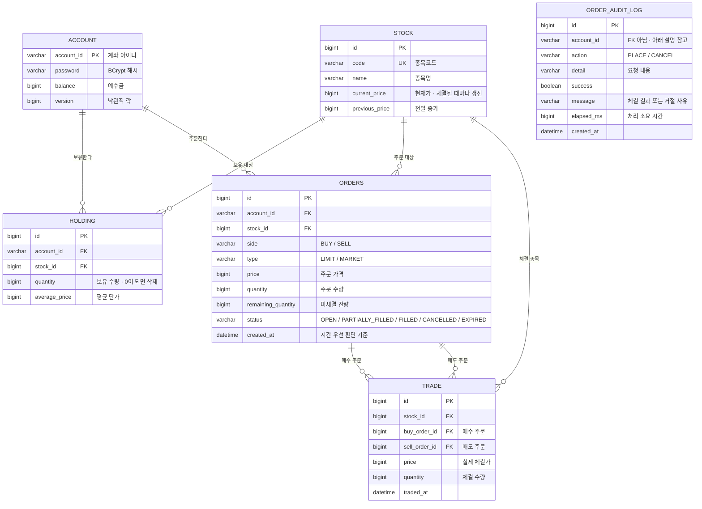
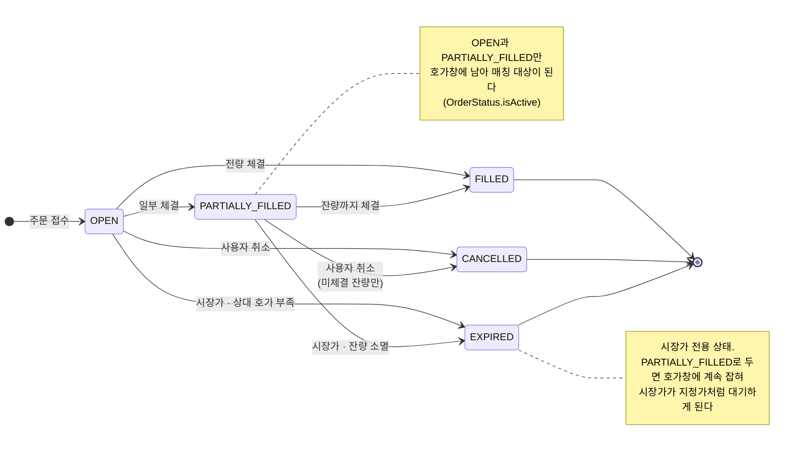

# SKALA Trading

호가·체결 기반 주식 거래 시스템. SKALA KDT Back-end 최종 실습과제.

**외부 증권 API를 사용하지 않습니다.** 주문 접수 · 호가 관리 · 매칭 · 체결 · 정산을 직접
구현했으며, 화면에 보이는 현재가는 이 시스템 안에서 실제로 체결된 가격입니다.

```
skala-trading/
├── api/   Spring Boot 3.3 · Java 21 · JPA · H2      (:8080)
├── fe/    React 19 · Vite · TypeScript · Tailwind 4 (:5173)
└── docker-compose.yml
```

---

## 실행

### 도커 없이

```bash
# 백엔드
cd api && ./gradlew bootRun

# 프론트엔드 (새 터미널)
cd fe && pnpm install && pnpm dev
```

### 도커로

```bash
docker compose up --build
```

별도 DB를 준비할 필요가 없습니다. 저장소는 H2 인메모리이며, 기동할 때
종목 12개와 계좌 6개를 만들고 호가창을 채운 뒤 자동 매매 봇이 시장을 굴리기 시작합니다.

| 주소 | 설명 |
| --- | --- |
| http://localhost:5173 | 거래 화면 |
| http://localhost:8080/swagger-ui.html | API 문서 |
| http://localhost:8080/actuator/health | 상태 점검 |
| http://localhost:8080/h2-console | H2 콘솔 (JDBC URL `jdbc:h2:mem:tradingdb`, 사용자 `sa`) |

**데모 계좌** — `trader01` / `trader02` / `trader03`, 비밀번호는 모두 `pw1234`
(예수금 각각 1억 · 3억 · 5억. 화면에서 계좌를 직접 개설할 수도 있습니다.)

---

## 요구사항 대응

과제 명세는 상품·고객·주문 도메인이지만, 아이템을 증권으로 바꿔도 된다는 안내에 따라
**상품 → 종목 / 포인트 → 예수금 / 주문 → 매수·매도 주문**으로 옮겼습니다.
요구된 규칙은 모두 같은 의미로 대응됩니다.

| 요구사항 | 구현 | 위치 |
| --- | --- | --- |
| 회원가입 | 계좌 개설, 비밀번호 BCrypt 해시 | `POST /api/accounts` · `AccountService` |
| 로그인 (JWT) | 토큰 발급, 헤더·쿠키 모두 지원 | `POST /api/accounts/login` · `SessionHandler` |
| 상품 조회 | 종목 목록 · 상세 · 코드 조회 | `GET /api/stocks/list`, `/{id}`, `/code/{code}` |
| 주문 | 매수·매도 접수 후 즉시 매칭 | `POST /api/orders` · `OrderService.placeOrder` |
| 포인트 차감 | 매수 시 예수금 차감, 매도 시 보유 수량 차감 | `Account.withdraw` · `OrderService.reserveHolding` |
| 주문 확인 | 내 주문·체결 내역 조회 | `GET /api/orders/me`, `/me/trades` |
| 주문 취소 + 환급 | 미체결 잔량만 취소, 묶인 예수금·수량 반환 | `POST /api/orders/{id}/cancel` |
| 포인트 부족 처리 | `INSUFFICIENT_FUNDS` → 400 | `Error` · `GlobalExceptionHandler` |
| 같은 상품 재주문 시 누적 | 매수 시 보유 수량 누적, 평균 단가 재계산 | `Holding.addBuy` |
| 매도 시 차감 (0이면 삭제) | 매도 주문 시 수량 차감, 0주가 되면 보유 레코드 삭제 | `OrderService.reserveHolding` |
| 1 : N 관계 | 계좌 1 : N 보유·주문, 종목 1 : N 주문·체결 | ERD 참고 |
| 트랜잭션 | 주문·취소 전 구간 `@Transactional` | `OrderService` |
| 입력 검증 | `@Valid` + 항목별 오류 메시지 | `OrderRequest` · `AccountSession` |
| 전역 예외 처리 | 공통 응답 형식으로 변환 | `GlobalExceptionHandler` |
| API 문서화 | Swagger, 응답 코드까지 명시 | `@Operation` · `@ApiResponses` |
| 계층 분리 | Controller → Service → Repository | 도메인별 패키지 |

### 선택 항목

| 항목 | 구현 |
| --- | --- |
| Actuator | 기본 엔드포인트 + **커스텀 지표** `market` (호가 충실도) |
| AOP | 주문·취소 감사 로그 (`OrderAuditAspect`) |
| Docker | `api` + `web` 2개 컨테이너, `docker compose up` |
| 테스트 | 27건 (매칭 · 시장가 · 동시성 · API 통합) |
| 프론트엔드 | React 거래 화면 (요구사항 아님) |

---

## 도메인 모델



**체결(TRADE)이 주문을 두 번 참조하는 이유** — 하나의 체결은 매수 주문과 매도 주문이 만나서
생깁니다. 어느 한쪽만 기록하면 상대를 되짚을 수 없어 정산 근거가 남지 않습니다.

**감사 로그(ORDER_AUDIT_LOG)만 외래키가 없는 이유** — 이 기록은 주문 트랜잭션과 분리된
트랜잭션에서 저장됩니다(`REQUIRES_NEW`). 거절되어 롤백된 주문도 기록이 남아야 하는데,
외래키로 묶으면 존재하지 않는 주문을 참조하게 되어 저장 자체가 실패합니다.

**보유 종목(HOLDING)의 유일 제약** — `account_id + stock_id`에 유니크 제약을 걸어
같은 계좌가 같은 종목을 두 줄로 갖지 못하게 합니다. 재매수는 새 행이 아니라
기존 행의 수량 누적과 평균 단가 재계산으로 처리됩니다.


### 주문 상태 흐름



**EXPIRED가 따로 있는 이유** — 처음에는 시장가의 미체결 잔량을 `PARTIALLY_FILLED`로 두었습니다.
그랬더니 그 주문이 호가창 조회와 매칭 대상에 계속 잡혀, 가격을 부르지 않은 시장가 주문이
지정가처럼 대기했습니다. 매수 시장가의 내부 상한값(`Long.MAX_VALUE`)이 호가창에 그대로
노출되기까지 해서 별도 상태로 분리했습니다.

**취소는 미체결 잔량에만 적용됩니다** — 이미 체결된 부분은 되돌리지 않습니다.
`PARTIALLY_FILLED`에서 취소하면 남은 수량만큼의 예수금·보유 수량만 반환됩니다.

---

## 차별화 포인트

### 1. 주문 체결 엔진

교재 예제의 주문은 "재고를 확인하고 차감"하는 단방향 처리입니다.
이 프로젝트는 **주문끼리 서로 만나 가격이 결정되는** 구조로 만들었습니다.

- **가격 우선 → 시간 우선** — 매수는 싼 매도호가부터, 같은 가격이면 먼저 낸 주문부터 체결
- **부분 체결** — 여러 호가에 걸쳐 나눠 체결되고 남은 수량은 호가창에 등록
- **가격 개선 환급** — 231,500원에 매수 주문을 냈는데 231,000원에 체결되면 차액을 돌려줌
- **자전거래 방지** — 같은 계좌의 매수·매도는 서로 체결되지 않음
- **시장가** — 가격을 부르지 않고 호가를 훑어 체결, 채우지 못한 잔량은 `EXPIRED`로 소멸
- **체결가가 현재가** — 외부 시세를 받아오지 않고 체결 결과가 그대로 종목 현재가가 됨

### 2. 동시성 제어

같은 매도 호가를 두 매수 주문이 동시에 노리면, 잠금이 없을 때 둘 다 "10주가 남아 있다"를
읽고 각자 10주를 체결시킵니다. 없는 물량이 팔리는 것입니다.

```java
@Lock(LockModeType.PESSIMISTIC_WRITE)
@Query("select s from Stock s where s.id = :id")
Optional<Stock> findByIdForUpdate(Long id);
```

종목 단위로 잠가 같은 종목의 주문을 직렬화했습니다.
`ConcurrentOrderTest`가 10주 호가에 10주 매수 두 건을 동시에 넣어 **정확히 10주만** 체결되는지
검증합니다. 계좌에는 낙관적 락(`@Version`)을 함께 걸어 두었습니다.

### 3. 실시간 시세 (SSE)

체결이 일어나면 서버가 접속 중인 화면에 바로 전송합니다. 폴링과 달리 보낼 것이 있을 때만
데이터가 오갑니다.

```java
@TransactionalEventListener(phase = TransactionPhase.AFTER_COMMIT)
public void onMarketEvent(MarketEvent event) { broadcast(event); }
```

`AFTER_COMMIT`이 중요합니다. 커밋 전에 보내면 롤백된 거래가 화면에 체결로 표시됩니다.

### 4. 자동 매매 봇

아무도 주문하지 않아도 시장이 움직이도록 봇이 초당 약 20건을 체결시킵니다.
실제 시장처럼 역할을 나눴습니다.

- **market01** — 현재가 주변에 양방향 호가를 대기만 함 (마켓메이커)
- **bot01 / bot02** — 걸린 호가를 걷어가 체결을 만듦 (테이커, 매수·매도 계좌 분리)

계좌를 나눈 이유가 있습니다. 한 계좌가 양쪽을 다 맡으면 자전거래 방지 때문에 같은 계좌의
매수호가와 매도호가가 서로 만나도 체결되지 않아, **매수호가가 매도호가보다 높은 교차된
호가창**이 굳어버립니다. 실제로 겪고 나서 구조를 바꿨습니다.

거래량은 순위에 반비례하는 가중치로 배분합니다(삼성전자 32%, SK하이닉스 16% …).
모든 종목을 균등하게 고르면 시세판이 일정하게 움직여 오히려 인공적으로 보입니다.

`app.bot.enabled=false`로 끌 수 있습니다.

### 5. AOP 감사 로그

성공이든 실패든 모든 주문을 기록합니다.

```java
@Aspect
@Order(1)   // @Transactional 프록시보다 바깥
public class OrderAuditAspect { ... }

@Transactional(propagation = Propagation.REQUIRES_NEW)
public void record(...) { ... }
```

`@Order(1)`이 없으면 트랜잭션 안쪽에서 실행되어 롤백 여부를 알 수 없고,
`REQUIRES_NEW`가 없으면 **거절된 주문의 기록이 함께 롤백되어 사라집니다.**
실패 기록이야말로 남아야 하는 정보입니다.

화면의 `내역 → 처리 기록` 탭에서 볼 수 있습니다.

### 6. 커스텀 상태 지표

프로세스가 살아 있고 DB에 붙어 있어도 거래가 가능한 것은 아닙니다.
한쪽 호가가 비면 그 방향 시장가 주문은 받을 수 없고 화면상으로도 고장으로 보입니다.
기본 헬스체크로는 잡히지 않아 별도 지표를 만들었습니다.

```
GET /actuator/health
{ "market": { "status": "UP",
    "details": { "종목 수": 12, "양방향 호가 종목": 12, "호가 충실도": "100%" } } }
```

### 7. 거래 화면

요구사항에는 없지만, API만으로는 매칭 엔진이 실제로 동작하는지 보이지 않아 함께 만들었습니다.

- 종목 · 차트 · 호가창 · 주문을 한 화면에 둔 데스크톱 트레이딩 레이아웃
- 호가 클릭 → 주문 가격 자동 입력, 체결 시 현재가 강조
- 다크 모드, 1280px 미만 반응형
- 차트는 우리 체결 데이터로 그림 (외부 시세를 쓰지 않는다는 전제와 일관)

---

## 테스트

```bash
cd api && ./gradlew test
```

27건 전부 통과합니다. 봇과 호가 시딩은 `application-test.yml`에서 꺼둡니다.
켜져 있으면 테스트가 만든 호가를 봇이 먹어 결과가 매번 달라집니다.

| 클래스 | 건수 | 검증 내용 |
| --- | --- | --- |
| `OrderMatchingTest` | 12 | 가격·시간 우선, 부분 체결, 가격 개선 환급, 자전거래 방지, 보유 누적·삭제 |
| `MarketOrderTest` | 5 | 호가 훑기, 실제 체결액만 차감, 잔량 소멸 |
| `OrderApiTest` | 9 | JWT, 입력 검증, 404/401, 취소 환급, AOP 감사 로그 |
| `ConcurrentOrderTest` | 1 | 동시 매수 2건 → 정확히 10주만 체결 |

---

## 프로젝트 구조

도메인별로 나눴습니다. 계층별(`controller/`, `service/`)로 나누면 기능 하나를 고칠 때마다
서로 먼 폴더를 오가야 합니다.

```
api/src/main/java/com/sk/skala/trading/
├── account/    계좌 · 보유 종목
├── stock/      종목 · 호가창 조회
├── order/      주문 · 체결 · 매칭 엔진   ← 핵심
├── market/     실시간 스트림 · 자동 매매 봇 · 상태 지표
├── audit/      AOP 감사 로그
├── common/     공통 응답 · 페이징 · 세션
├── config/     설정 · 초기 데이터
└── exception/  전역 예외 처리

fe/src/
├── api/         HTTP 클라이언트 · 엔드포인트 · 타입
├── components/  ui · layout · invest
├── hooks/       SSE 구독 · 캐시 동기화
├── lib/         포맷 · 쿼리 클라이언트
├── pages/       주문 · 시세 · 자산 · 내역 · 로그인
└── store/       인증 · UI 상태
```

---

## 기술 선택 메모

| 선택 | 이유 |
| --- | --- |
| H2 인메모리 | 받은 사람이 DB를 준비하지 않고 바로 실행할 수 있어야 함. 테스트도 별도 DB 없이 동작 |
| Spring Security 미사용 | 인증은 JWT 한 겹이면 충분. 필터체인을 넣으면 모든 경로에 설정이 필요해짐. 해시만 `spring-security-crypto` 사용 |
| SSE (WebSocket 아님) | 서버→클라이언트 단방향이면 충분하고, 끊겨도 브라우저가 알아서 재접속 |
| Vite 프록시 / nginx 프록시 | 프론트와 API를 같은 오리진으로 맞춰 CORS 설정을 두지 않음 |
